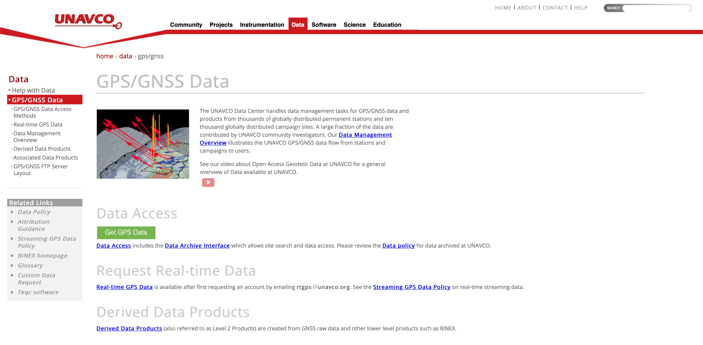

# UNAVCO GPS Position Time Series Download
This package can automatically download GPS position time series data for all the requested set of stations by taking advantage of the UNAVCO web services. The stations can be requested by geographical coordinates for a region, or using the input text file.

## Parameter setting:
--> `stn = "MDMT"` The four character station identifier.

--> `analysisCenter = "cwu"` GPS station position solutions are available from 4 different Analysis Centers (AC's).
#other options are - pbo, nmt, unr
CWU is the default AC and is the standard GAGE data product as of 2018-09-16. PBO and NMT solutions are only available up until 2018-09-15. PBO solutions were a combination of NMT and CWU solutions and are considered to be the standard GAGE data product.

--> `referenceFrame = "nam14"` Reference Frame used for the position coordinates. 
Coordinates in NAM14 are available from all AC's with the exception of UNR. Coordinates in a North America fixed reference frame are also available from all AC's but PBO, NMT, CWU use "NAM08" while UNR uses "NA12". NAM08 and NA12 are realized in different ways.

--> `sttime = "2013-01-01"` starttime of data request
--> `edtime = "2018-01-01"` endtime of data request
`edtime = ""` for last date available.

--> `dataPostProcessing = "Cleaned"` Processing performed on data after retrieved. 
"Uncleaned" - no post processing performed - data is returned as retrieved (default) "Cleaned" - The offset values for North, East or Up are set to NULL when the Standard deviation for the timestamp and direction > 20 millimeters.

--> `refCoordOption = "from_analysis_center"`
Select whether position solution offsets are relative to the "reference position" indicated in the source file (default) or whether the coordinate for the first epoch is adjusted to be 0.000m. The actual relative station displacements through time are the same regardless of option selected.
options - "from_analysis_center" or "first_epoch"

  

## PS: 
The metadata for the stations stored in the all_GPS_stations_data.json can be downloaded using the webservice 

https://www.unavco.org/data/web-services/documentation/documentation.html#!/gps/getPositionByStationId

using the fourcharid.

